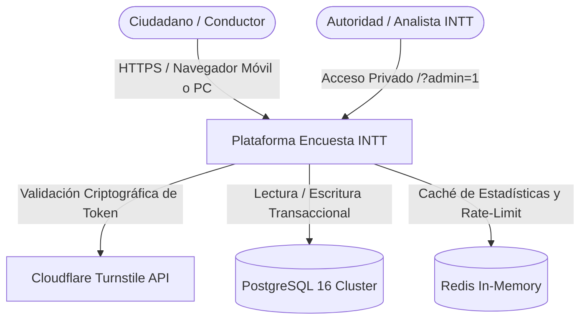
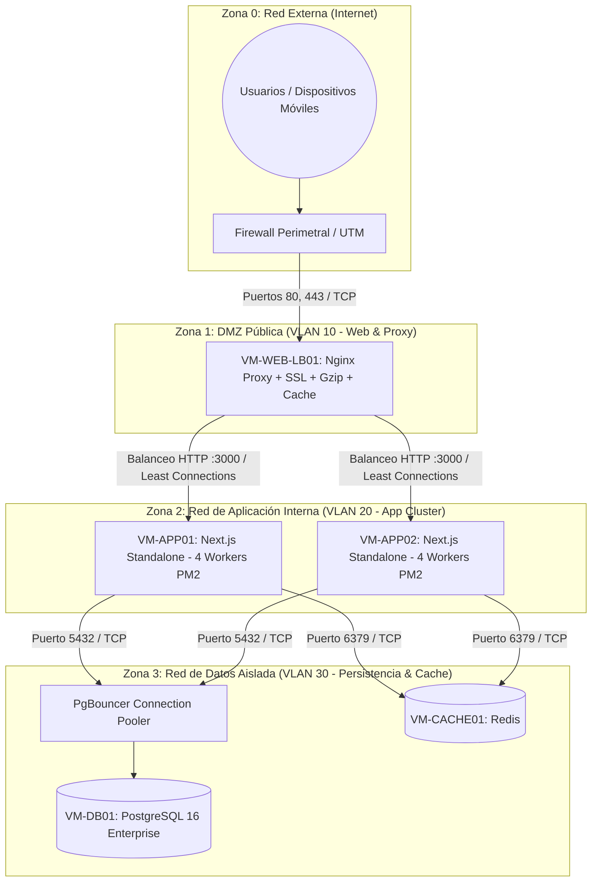
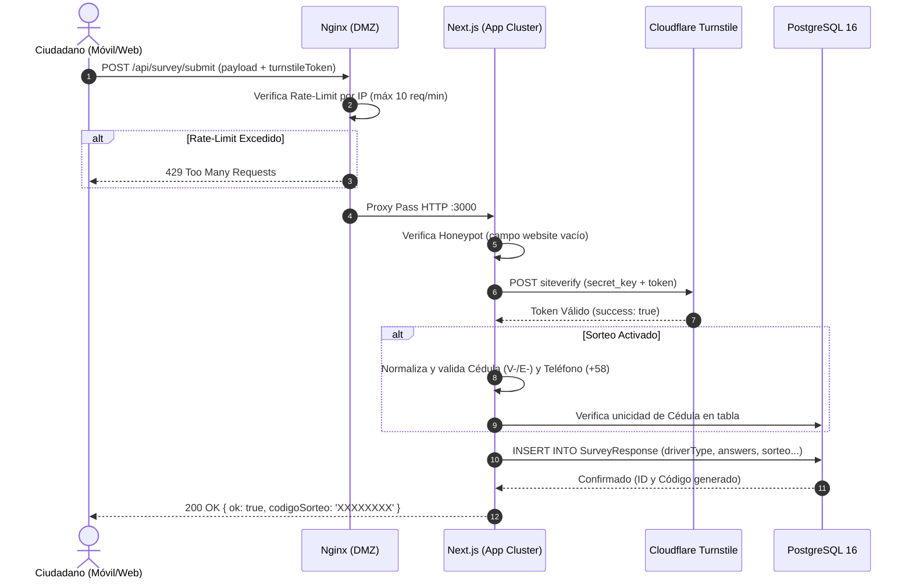

# Documento de Arquitectura Requerida (SAD - Software Architecture Document)
**Proyecto:** Encuesta Visión Cero — Instituto Nacional de Transporte Terrestre (INTT)  
**Alcance:** Sistema de recolección de datos masivo y analítica con capacidad de 1.000.000 de encuestas en 15 días  
**Modalidad de Despliegue:** Centro de Datos Local (On-Premises / Datacenter INTT)  
**Versión:** 1.1.0  
**Fecha:** Septiembre 2026  
**Estado:** Actualizado y Validado con PostgreSQL  

---

## 1. Introducción y Objetivos Arquitectónicos

### 1.1. Propósito
Este documento establece la arquitectura integral (lógica, de red, física, de datos y de seguridad) para la puesta en producción On-Premises de la plataforma web de la Encuesta *"Hacia una Visión Cero en Siniestros de Motocicletas"*. Provee la base técnica y de dimensionamiento que el equipo de Infraestructura, Redes, Base de Datos y Seguridad del INTT requiere para el aprovisionamiento.

### 1.2. Metas de Negocio y Métricas de Carga
* **Volumen Objetivo:** 1.000.000 de encuestas finalizadas y persistidas en un período de 15 días continuos.
* **Visitantes Totales Estimados:** 2.000.000 a 3.000.000 de personas (considerando una tasa de deserción del 40-50%).
* **Concentración Temporal:** El 70% del tráfico se presentará en la franja diurna/laboral (08:00 a 20:00).
* **Throughput Promedio Diurno:** ~1,1 a 1,5 envíos por segundo.
* **Throughput Pico Estimado (Burst Factor $\times 20$ a $\times 35$):** **30 a 50 transacciones por segundo (TPS / POST Submits)** durante anuncios en ruedas de prensa, cadenas o difusión masiva en redes institucionales.
* **Throughput de Red en Servidor Web:** **350 a 600 solicitudes HTTP por segundo (RPS)** en momentos de máxima concurrencia.
* **Disponibilidad Comprometida (SLA):** 99.9% durante los 15 días de campaña.

---

## 2. Requerimientos No Funcionales (NFRs)

| Categoría | Requerimiento | Criterio de Aceptación / Métrica |
| :--- | :--- | :--- |
| **Latencia de Envío** | Tiempo de persistencia de la encuesta | $\le 300\text{ ms}$ en condiciones de carga pico. |
| **Tiempo de Carga** | Primer contenido visible (FCP) | $\le 1,5$ segundos en dispositivos móviles con redes 3G/4G. |
| **Escalabilidad** | Aprovechamiento multinúcleo | Distribución balanceada de carga entre todos los cores de CPU (PM2 Cluster). |
| **Seguridad Anti-Bot** | Bloqueo de envíos automáticos | Verificación obligatoria de Cloudflare Turnstile + Rate-Limiting + Honeypot. |
| **Integridad Transaccional** | Cero pérdida y no duplicidad | Transacciones ACID en PostgreSQL; restricción de unicidad de cédula para sorteo. |
| **Seguridad Administrativa** | Protección del Panel de Resultados | Acceso privado bajo URL con cookie httpOnly firmada con HMAC-SHA256. |
| **Resiliencia** | Tolerancia a fallos de procesos | Reinicio automático de workers caídos en $< 2$ segundos mediante PM2. |

---

## 3. Vistas Arquitectónicas

### 3.1. Vista de Contexto del Sistema (Nivel 1 - C4)



### 3.2. Vista de Red y Topología Física On-Premises (Nivel 2)

La infraestructura On-Premises se organiza en **4 Zonas de Seguridad y VLANs segmentadas**, garantizando que la base de datos nunca tenga contacto directo con Internet:



---

## 4. Flujos de Información y Secuencia de Datos

### 4.1. Flujo de Envío de Encuesta (POST `/api/survey/submit`)



---

## 5. Especificación y Dimensionamiento de Infraestructura

### 5.1. Matriz de Dimensionamiento de Máquinas Virtuales (VMware / Proxmox / Nutanix)

| Máquina Virtual | Función Primaria | vCPU | Memoria RAM | Almacenamiento | Tecnología de Disco | Interfaz de Red |
| :--- | :--- | :--- | :--- | :--- | :--- | :--- |
| **VM-WEB-LB01** | Proxy Inverso Nginx, SSL, Compresión y Caché | 4 vCPU | 8 GB | 60 GB | SAS / SSD | 1 Gbps (VLAN 10 y 20) |
| **VM-APP01** | Nodo 1 de Aplicación (Next.js Standalone + PM2) | 6 vCPU | 12 GB | 80 GB | SSD | 1 Gbps (VLAN 20 y 30) |
| **VM-APP02** | Nodo 2 de Aplicación (Next.js Standalone + PM2) | 6 vCPU | 12 GB | 80 GB | SSD | 1 Gbps (VLAN 20 y 30) |
| **VM-DB01** | Motor PostgreSQL 16 + Connection Pool | 8 vCPU | 24 GB | 200 GB | **SSD NVMe (RAID 10)** | 10 Gbps / 1 Gbps (VLAN 30) |
| **VM-CACHE01** | Caché de Estadísticas y Sesiones (Redis) | 2 vCPU | 4 GB | 40 GB | SSD | 1 Gbps (VLAN 30) |
| **TOTALES MÍNIMOS** | **Infraestructura Completa Recomendada** | **26 vCPU** | **60 GB RAM** | **460 GB** | **SSD / NVMe** | Red Gigabit |

> **Escenario de Recursos Consolidados (Alternativa de 2 VMs):**  
> En caso de limitaciones de hardware en el datacenter, se puede consolidar en:  
> * **VM-WEB-APP (Consolidada):** 12 vCPU / 24 GB RAM (Nginx + PM2 con 8 workers).  
> * **VM-DATABASE:** 8 vCPU / 24 GB RAM (PostgreSQL 16 + Redis local).

### 5.2. Requerimientos de Red del Datacenter
* **Enlace de Internet Dedicado:** Mínimo **300 Mbps simétricos** (sin CDN) o **50 Mbps simétricos** (si se habilita Cloudflare al frente como escudo perimetral).
* **Direccionamiento IP:** 1 IP pública estática para el balanceador / firewall.
* **Puertos de Entrada Permitidos:** `80/TCP` (redirección a HTTPS) y `443/TCP` (HTTPS).
* **Puertos Internos Protegidos:** `3000/TCP` (Next.js), `5432/TCP` (PostgreSQL), `6379/TCP` (Redis).

---

## 6. Arquitectura de Software y Capa de Datos

### 6.1. Pila Tecnológica Homologada
* **Frontend:** React 19, TypeScript, Tailwind CSS v4, Shadcn UI, Framer Motion, Recharts.
* **Gestión de Estado:** Zustand (almacenamiento cliente, persistencia temporal de pasos y flujo condicional por tipo de conductor).
* **Backend:** Next.js 16 (App Router con compilación `standalone`), Node.js 22 LTS en modo cluster con PM2.
* **ORM:** Prisma ORM 6.x configurado con cliente nativo para PostgreSQL.
* **Base de Datos:** PostgreSQL 16/18 con almacenamiento de alta capacidad (`@db.Text` para el payload JSON).

### 6.2. Modelo de Datos Optimizado (`SurveyResponse`)

```prisma
model SurveyResponse {
  id              String   @id @default(cuid())
  driverType      String   // Motociclista, Delivery, Mototaxista, etc.
  answers         String   @db.Text // JSON completo con las respuestas
  completedAt     DateTime @default(now())

  // Datos del Sorteo (opcionales)
  participaSorteo Boolean  @default(false)
  nombre          String?
  cedula          String?  // Formato: V-12345678 o E-12345678
  telefono        String?  // Formato: +58 412-1234567
  codigoSorteo    String?  // Código alfanumérico único generado

  @@index([driverType])
  @@index([completedAt])
  @@index([participaSorteo])
  @@index([cedula])
}
```

### 6.3. Estimación de Almacenamiento en Base de Datos
* Registro promedio: $\approx 1,5\text{ KB}$ (metadatos + JSON de respuestas).
* 1.000.000 de registros: $\approx 1,5\text{ GB}$ de datos puros.
* Índices B-Tree optimizados: $\approx 600\text{ MB}$.
* Espacio con WAL logs, temporales y crecimiento: $\approx 20\text{ GB}$.
* **Conclusión:** Con los **24 GB de RAM** asignados a la máquina de base de datos, la totalidad de los datos e índices residen en memoria caché del sistema operativo, garantizando lecturas y escrituras en milisegundos sin estrangular los discos.

---

## 7. Modelo de Seguridad y Defensa en Profundidad

La solución implementa **4 capas concéntricas de seguridad**:

1. **Perímetro de Red y Servidor Web (Nginx):**
   * Limitación de peticiones (*Rate Limiting*) en `/api/survey/submit` (máximo 10 solicitudes por minuto por IP pública).
   * Cabeceras de seguridad estrictas:
     ```nginx
     add_header X-Frame-Options "DENY";
     add_header X-Content-Type-Options "nosniff";
     add_header X-XSS-Protection "1; mode=block";
     add_header Referrer-Policy "strict-origin-when-cross-origin";
     ```
2. **Capa Anti-Bot (Cloudflare Turnstile):**
   * Verificación obligatoria de token criptográfico en backend antes de permitir cualquier inserción en base de datos.
   * Campo señuelo (*Honeypot*) invisible para detección pasiva de navegadores automatizados.
3. **Capa de Aplicación y Autenticación del Dashboard:**
   * El panel de administración (`/?admin=1`) está protegido por sesión de cookie `httpOnly` firmada con **HMAC-SHA256**.
   * Validación de credenciales en tiempo constante (`crypto.timingSafeEqual`) para evitar ataques de canal lateral o temporización.
4. **Capa de Persistencia y Base de Datos:**
   * Aislamiento en VLAN privada (VLAN 30) sin acceso desde Internet.
   * Contraseñas de usuario encriptadas con algoritmo `SCRAM-SHA-256`.

---

## 8. Continuidad Operativa, Respaldos y Monitoreo

### 8.1. Métricas de Recuperación
* **RPO (Recovery Point Objective):** $\le 1\text{ hora}$.
* **RTO (Recovery Time Objective):** $\le 30\text{ minutos}$.

### 8.2. Política de Respaldos
1. **Respaldo Lógico Diario:** Tarea `cron` automatizada a las 02:00 AM ejecutando `pg_dump` con compresión `gzip`. Retención de 30 días en almacenamiento secundario/NAS.
2. **Archivado Continuo de WAL (PITR):** Habilitación de `archive_mode = on` para posibilitar la recuperación ante desastres hasta el minuto exacto anterior a cualquier eventualidad.

### 8.3. Monitoreo y Alertabilidad
* **Healthcheck Activo:** Sondeo periódico HTTP al endpoint de estado.
* **Supervisión de Procesos:** Consola de monitoreo `pm2 monit` para consumo de CPU/RAM de cada worker.
* **Métricas de PostgreSQL:** Seguimiento de conexiones activas vía `pg_stat_activity` para evitar saturación del pool.
